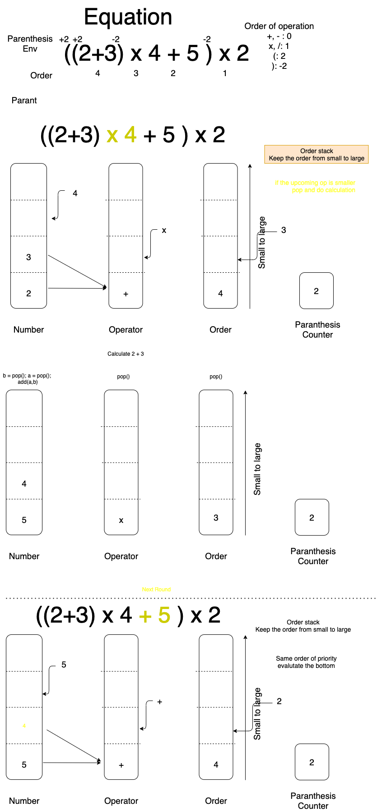

# EvilEval: Calculator in C (Parser)


## Algorithm




### Structure

- `Numbers`
- `Operators`
- `Orders`
- `Paranthesis counter`


#### Definition

- What is `Orders`
    - The order to be evaluated in an equation


#### Relation between `Numbers` / `Operators` / `Orders`

- `length(Numbers)` = `length(Operators)` + 1
    - Ex. `2/4`
- `Length(Operators)` = `Length(Orders)`

### Evaulation

```pseudo
# Do a/b
b = pop(Numbers)
a = pop(Numbers)
op = pop(Operators)
pop(Orders)

r = eval(op, a, b) # div(a,b)

push(Numbers, r)
```


### Initiate an evalution

```pseudo
op_new = read()
order_new = order_current  + order(op_new)
b_new = read()

if (Query(Orders) < order_new) # Add to list
    push(Orders, order_new)
    push(Operators, op_new)
    push(Numbers, b_new)
else 
    Do Evalution
```
Length affected by single evalution

### How to update order base `()`

```psudo

order_base = 0

while (symbol != EOF)
    symbol = read_char()

    if symbol == `(`
        order_base += 2
    else if(symbol == `)`)
        order_base -= 2
    else 
        Do Operation
end
```

Rule
1. `Evaluate` when the incoming order is smaller than the end of the stack


## String Operation


### Usage of `fscanf`


- Source: [Fun with “scanf” in c](https://medium.com/@zoha131/fun-with-scanf-in-c-3d7a8d310229)

#### Return Value

- Source: [TutorialPoint](https://www.tutorialspoint.com/c_standard_library/c_function_fscanf.htm)

##  Data Type and Range

|Data Type|Range|Size|
|---|---|---|
|`int`|-2,147483648E9 to 2.147483647E9|4 bytes|
|`double`|2.3E-308 to 1.7E+308|8 bytes|
|`Char`|1 Byte|


- Source: [TutorialPoint](https://www.tutorialspoint.com/cprogramming/c_data_types.htm)


## Constraints

- Maximum storage: **1GB**
- Time limit: **1s**

### Number of parameters

#### Input String Size

|Symbol|Description|
|:---:|:---:|
|$L$|length of a line|
|$T$|Lines|

- $L < 10^6$
    - Maximum usage of memory
        - 8MB
        - RAM: 10 MB
- $L\cdot T \leq 10^6$
    - 1 MB

### Strategy of storage

- String
    - Store in **stack**
- Numbers / Operators / Orders
    - Store in **Heap** (`malloc`)

Test: https://onlinegdb.com/BJHmN8lNd


## Implementation

### What do I need?


- Package
    - Stack in Heap
        - Allow big storage

    - String Parser
        - Get `+-*/`
        - Get Numbers
    - Equation Eval

- Algorithm
    - Arithmatic Operation
        - In `Equation Eval`


- Create test data
    - `input.txt`
    - `output.txt`


### Stack 

Use `Array` to implement a stack

### What data type we need?

- Stack for `double`: `Numbers`
- Stack for `int`: `Orders`
- Stack for `enum`: `Operators`

[*Tutorial for `enum`*](https://michaelchen.tech/c-programming/enumeration/)

#### Structure of a stack
```pseudo
structure stack:
    maxsize : integer
    top : integer
    items : array of item
```

#### Procedures

##### Initiation 

```pseudo
procedure initialize(stk : stack, size : integer):
    stk.items ← new array of size items, initially empty
    stk.maxsize ← size
    stk.top ← 0
```

##### Push

```pseudo
procedure push(stk : stack, x : item):
    if stk.top = stk.maxsize:
        report overflow error
    else:
        stk.items[stk.top] ← x
        stk.top ← stk.top + 1
```

##### Pop

```pseudo
procedure pop(stk : stack):
    if stk.top = 0:
        report underflow error
    else:
        stk.top ← stk.top − 1
        r ← stk.items[stk.top]
        return r
```


### Test Data

 To solve `test/data/input.txt` to `test/data/output.txt`. Set path to the top of the project.

 ```bash
 make DATA
 ```

#### File reader in Julia

```julia
julia> open("myfile.txt", "w") do io
           write(io, "Hello world!")
       end;

julia> open(f->read(f, String), "myfile.txt")
"Hello world!"
```

With `Formatter.jl` for formatting the scintific representation.

#### Format of input/output

|Input|Output|
|:---:|:---:|
|||

- Two `\n` for separate inputs
- One `\n` for separate outputs


---

## Notes of C language

### enum

```c
/* Foreward declaration. */
typedef enum direction Direction;

enum direction {
    North,
    South,
    East,
    West
};

int main(void)
{
    Direction dest = East;
    
    return 0;
}
```

### How to create a struct with element stored in heap

The struct have to be created in stack and use the pointer to heap.

#### Struct
```c
struct a;
int maxsize;
init_stack_double(&a, maxsize);
```

#### Initiation
```c
void init_stack_double(stack_double* sd, int maxsize){
    sd->items = (double*)malloc(maxsize*sizeof(double));
    sd->maxsize = maxsize;
    sd->top = 0;
}
```